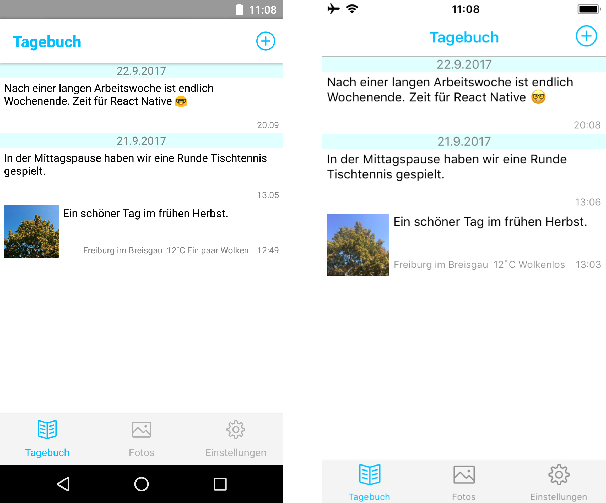

# MyJournal

Beispiel-App im [O'Reilly-Buch zu React Native](https://www.oreilly.de/buecher/13088/9783960090663-react-native.html)

1. Projekt clonen oder herunterladen: `git clone https://github.com/behrends/MyJournal.git`
1. Ins Projektverzeichnis wechseln: `cd MyJournal`
1. npm-Packages für das Projekt installieren: `npm install`
1. React Native Packager starten mit `expo start` 

